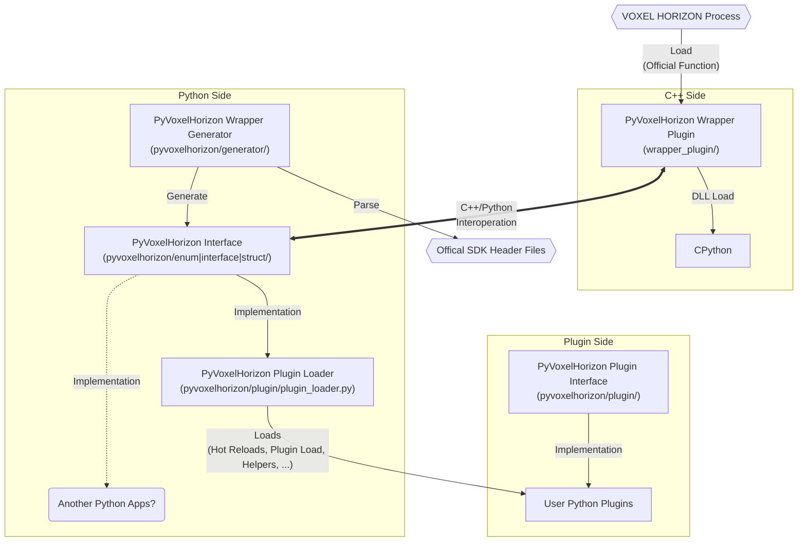

# PyVoxelHorizon
Are you looking for PyVoxelHorizon DLL injection version? See this [branch](https://github.com/devjeonghwan/PyVoxelHorizon/tree/injection_version) 

# Structure

```mermaid
flowchart TD
    USER_PLUGIN["User Python Plugins"]
    PY_VOXEL_HORIZON_PLUGIN_LOADER["PyVoxelHorizon Plugin Loader\n(pyvoxelhorizon/plugin/plugin_loader.py)"]
    PY_VOXEL_HORIZON_PLUGIN["PyVoxelHorizon Plugin Interface\n(pyvoxelhorizon/plugin/)"]
    PY_VOXEL_HORIZON["PyVoxelHorizon Interface\n(pyvoxelhorizon/enum|interface|struct/)"]
    PY_VOXEL_HORIZON_WRAPPER["PyVoxelHorizon Wrapper Plugin\n(wrapper_plugin/)"]
    PY_VOXEL_HORIZON_WRAPPER_GENERATOR["PyVoxelHorizon Wrapper Generator\n(pyvoxelhorizon/generator/)"]
    VOXEL_HORIZON{{"VOXEL HORIZON Process"}}
    VOXEL_HORIZON_HEADER_FILE{{"Offical SDK Header Files"}}
    
    VOXEL_HORIZON -->|"Load\n(Official Function)"| PY_VOXEL_HORIZON_WRAPPER
    PY_VOXEL_HORIZON_WRAPPER_GENERATOR -->|"Parse"| VOXEL_HORIZON_HEADER_FILE

    subgraph C++ Side
    PY_VOXEL_HORIZON_WRAPPER -->|"DLL Load"| PYTHON["CPython"]
    end
    
    subgraph Python Side
    PY_VOXEL_HORIZON_WRAPPER_GENERATOR -->|"Generate"| PY_VOXEL_HORIZON

    PY_VOXEL_HORIZON_WRAPPER <==>|"C++/Python\nInteroperation"| PY_VOXEL_HORIZON
    PY_VOXEL_HORIZON -->|"Implementation"| PY_VOXEL_HORIZON_PLUGIN_LOADER
    PY_VOXEL_HORIZON -..->|"Implementation"| IMPL1("Another Python Apps?")
    end

    subgraph Plugin Side
    PY_VOXEL_HORIZON_PLUGIN -->|"Implementation"| USER_PLUGIN
    PY_VOXEL_HORIZON_PLUGIN_LOADER -->|"Loads\n(Hot Reloads, Plugin Load, Helpers, ...)"| USER_PLUGIN
    end
```
