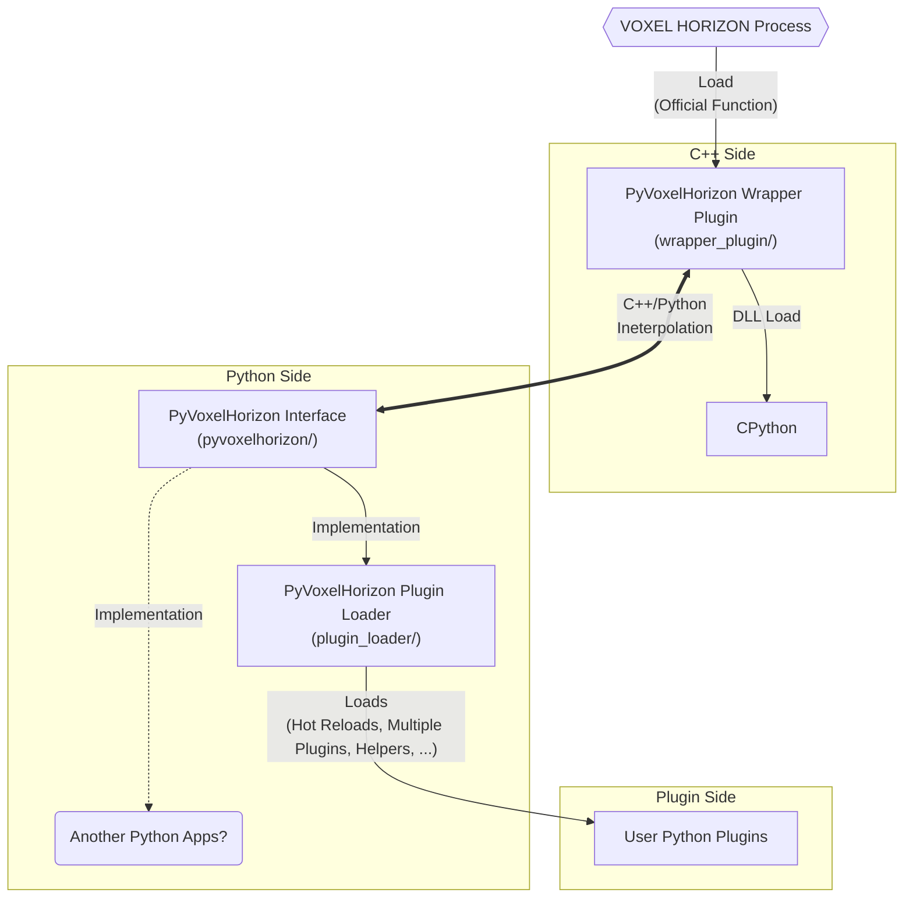

# PyVoxelHorizon

# Structure

```mermaid
flowchart TB
    USER_PLUGIN["User Python Plugins"]
    PY_VOXEL_HORIZON_PLUGIN_LOADER["PyVoxelHorizon Plugin Loader\n(plugin_loader/)"]
    PY_VOXEL_HORIZON["PyVoxelHorizon Interface\n(pyvoxelhorizon/)"]
    PY_VOXEL_HORIZON_WRAPPER["PyVoxelHorizon Wrapper Plugin\n(wrapper_plugin/)"]
    VOXEL_HORIZON{{"VOXEL HORIZON Process"}}
    
    VOXEL_HORIZON -->|"Load\n(Official Function)"| PY_VOXEL_HORIZON_WRAPPER

    subgraph C++ Side
    PY_VOXEL_HORIZON_WRAPPER -->|"DLL Load"| PYTHON["CPython"]
    end
    
    subgraph Python Side
    PY_VOXEL_HORIZON_WRAPPER <==>|"C++/Python\nIneterpolation"| PY_VOXEL_HORIZON
    PY_VOXEL_HORIZON -->|"Implementation"| PY_VOXEL_HORIZON_PLUGIN_LOADER
    PY_VOXEL_HORIZON -..->|"Implementation"| IMPL1("Another Python Apps?")
    end
    
    subgraph Plugin Side
    PY_VOXEL_HORIZON_PLUGIN_LOADER -->|"Loads\n(Hot Reloads, Multiple Plugins, Helpers, ...)"| USER_PLUGIN
    end
```