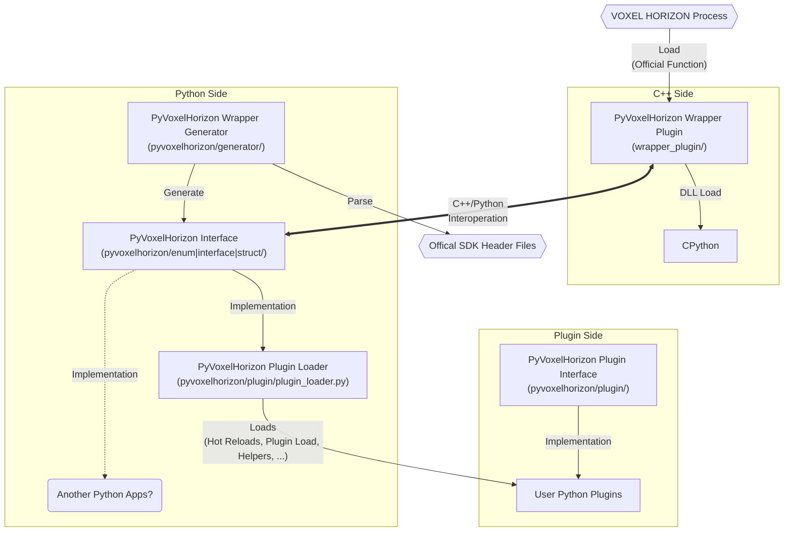

# PyVoxelHorizon
Are you looking for PyVoxelHorizon DLL injection version? See this [branch](https://github.com/devjeonghwan/PyVoxelHorizon/tree/injection_version) 

## What is PyVoxelHorizon?
A framework that attaches CPython using the Voxel Horizon official SDK and provides Python Wrapper API.

# Structure

## How to development Plugin without C++ Build?
1. Install [Python 3.11](https://www.python.org/downloads/release/python-3110/) for all users
2. Download `PyVoxelHorizon_{Build Number}.zip` from [releases](https://github.com/devjeonghwan/PyVoxelHorizon/releases) and extract all files to `{VOXEL HORIZON Path}/Plugin/bin/`
3. Write plugin code and Save into `{VOXEL HORIZON Path}/Plugin/bin/PyVoxelHorizon/plugins`
    - [Basic Plugin](sample/basic_plugin.py)
    - [MIDI Player Plugin](sample/midi_example_plugin.py)
4. Run VOXEL HORIZON
5. Press the '`' key to open the console
6. Enter the `load_plugin PyVoxelHorizon_x64_Release.dll`
7. Or, You can also uses command arguments. See [official document](https://github.com/megayuchi/VH_SDK)

## How to development `PyVoxelHorizon Wrapper Plugin`?
1. Install [Python 3.11](https://www.python.org/downloads/release/python-3110/) with enabled `development/embedded` options for all users
2. Set environment variable `PYTHON_PATH` to the path where Python is installed.
3. Set environment variable `VOXEL_HORIZON_PATH` to the path where VOXEL HORIZON is installed.
4. Open `wrapper_plugin/PyVoxelHorizon.sln` using Visual Studio 2022
5. Build or Debug

## How to development `PyVoxelHorizon Interfaces`?
Sorry, Not ready yet.

## How to development `PyVoxelHorizon Wrapper Generator`?
Sorry, Not ready yet.

## Troubleshoot
### `ModuleNotFoundError` occurred when running the plugin.

The Python moule that the plugin uses is not installed.

It can be resolved through `pip install {Module Name}`. (For photo examples, `pip install umidiparser`)
